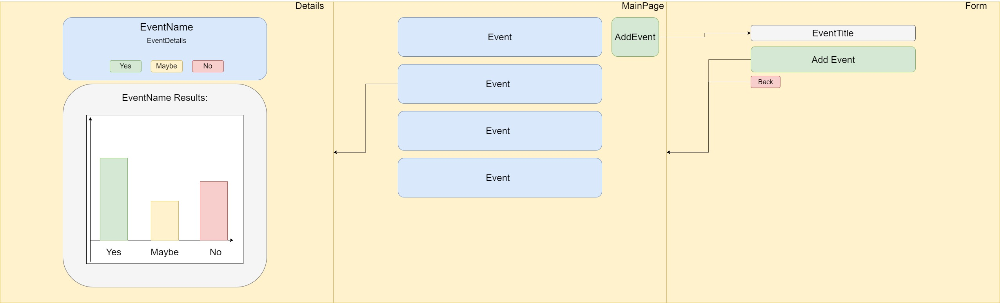
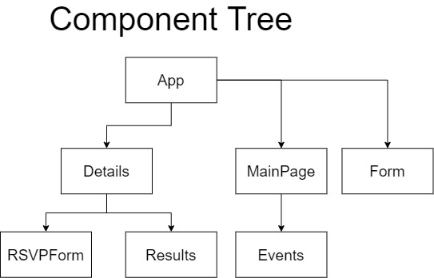

# Event Planner 

#### An application built with react and NoSQL that allows users to add and rsvp to existing events. 

#### By Zakkrey Short, Steph Podolak, Keturah Howard, Jamison Cozart

## Component Tree

## Wireframe

## User Stories

* As a user, I want to be able to look at all events so I can decide what I want to look at
* As a user, I want to be able to select an event to see the analytics of provious responses
* As a user, I want to be able to give my status on whether I am going, might be going, or not going an event, and see in reali time my response effecting the graph
* As a user, I want to be able to create an event and see it appear in the events list

## Technologies Used

* Node.js
* Webpack
* npm
* Javascript
* jQuery
* React
* Redux

This project was bootstrapped with [Create React App](https://github.com/facebook/create-react-app).

## Available Scripts

In the project directory, you can run:

### `npm start`

Runs the app in the development mode. 
Open [http://localhost:3000](http://localhost:3000) to view it in the browser.

The page will reload if you make edits. 
You will also see any lint errors in the console.

### `npm run build`

Builds the app for production to the `build` folder. 
It correctly bundles React in production mode and optimizes the build for the best performance.

The build is minified and the filenames include the hashes. 
Your app is ready to be deployed!

See the section about [deployment](https://facebook.github.io/create-react-app/docs/deployment) for more information.

### License

[MIT](https://choosealicense.com/licenses/mit/)

Copyright &copy; 2020 **_Zakkrey Short, Steph Podolak, Keturah Howard, Jamison Cozart_** 